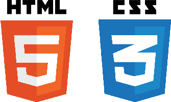

<h2>👋 Salut, je suis Yannick.</h2>

📚 Former à la WildCodeSchool comme développeur full-stack.

<h3> Compétences </h3>

Contactez-moi :

<!--
**yannick-cousin/yannick-cousin** is a ✨ _special_ ✨ repository because its `README.md` (this file) appears on your GitHub profile.

Here are some ideas to get you started:

- 🔭 I’m currently working on ...
- 🌱 I’m currently learning ...
- 👯 I’m looking to collaborate on ...
- 🤔 I’m looking for help with ...
- 💬 Ask me about ...
- 📫 How to reach me: ...
- 😄 Pronouns: ...
- ⚡ Fun fact: ...
-->
